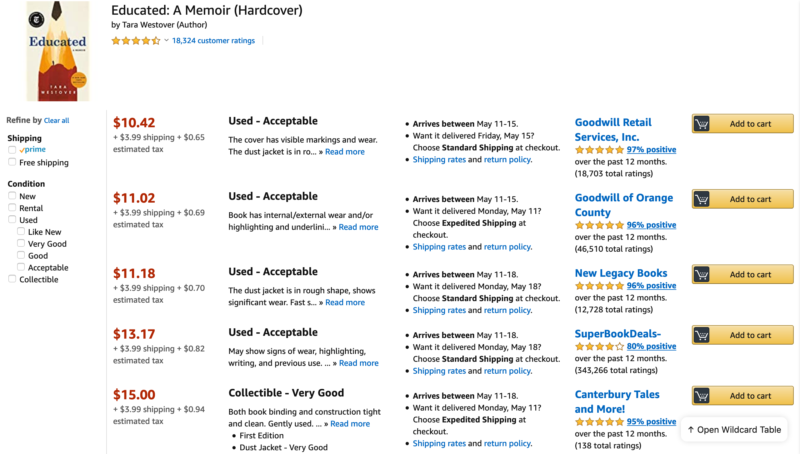
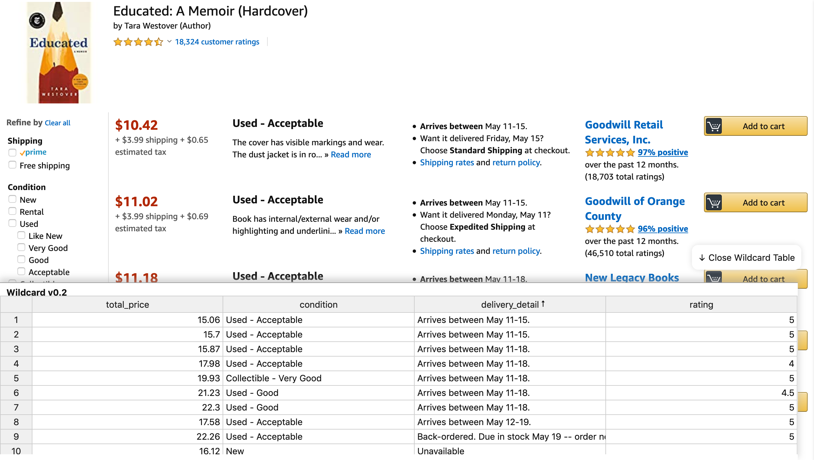
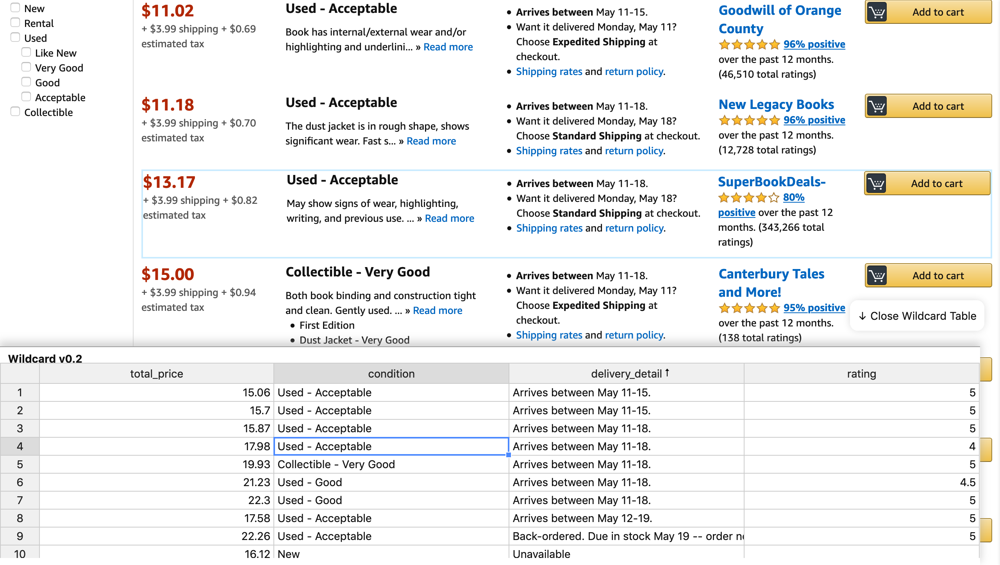
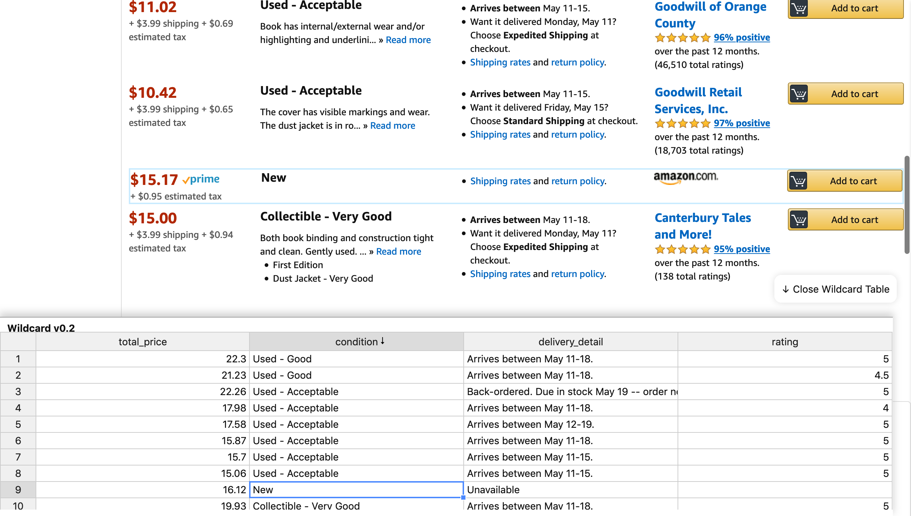

# Amazon Demo

When browsing through used products on Amazon, users are not shown the total cost of these product. With Wildcard, they can not just see the total cost but also sort the items in the page by price, rating, condition, delivery date, etc.

**
 The list before Wildcard is opened 
**

 
 
 

**
 Wildcard opened on the page. Notice how relevant information has been extracted into the spreadsheet
**

 
 

**
 When the user selects a row, the corresponding element is highlighted in Wildcard
**

 
 

**
 Wildcard computes the total price from the three listed per item, and sorts the total price in ascending order
**

 
 

**
 On the other hand, Wildcard can sort price in descending order
**

 
 

**Notice that by sorting the condition of the books, the user will find that the New copy costs only $1.06 more than the used copy**

